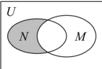
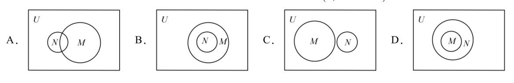
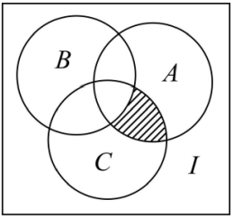
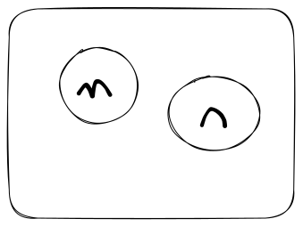
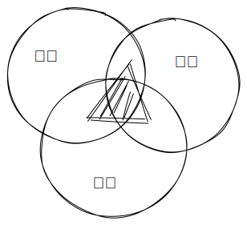
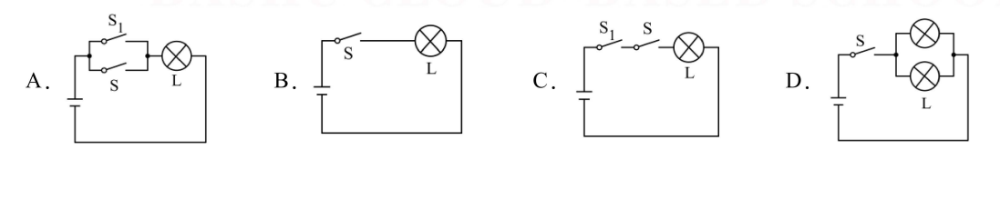
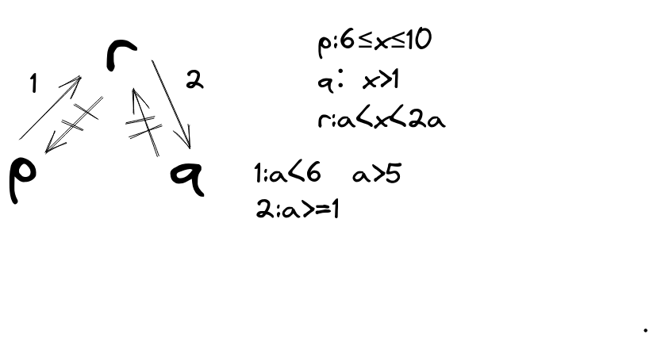

# 题型一：元素与集合的关系

## 【例 1】已知集合$A = \{12,a^2+4a,a-2\}$, $-3 \in A$,则$a=(\ \ )$

### 答案：$D$

- A.$-1$
- B.$-3$或$-1$
- C.$3$
- D.$-3$

> > 这是 Markdown 数学公式演示
>
> - 1.$-3 = a^2+4a$
>
> $$
> \begin{align}
> &\to(a+1)(a+3)=0\\
> &\to a=-1 \ or \  a=-3\\
> &if\ \ a = -1\\
> &\to a-2 = -3\\
> &\because \ \ a^2+4a=-3\\
> &\therefore \ \ a\neq-1\\
> &if \ \ a = -3\\
> &\to a-2 = -5\\
> &\therefore \ \ a = -3
> \end{align}
> $$
>
> - 2.$-3 = a-2$
>
> $$
> \begin{align}
> &a=-1\\
> &\to a^2+4a = -3\\
> &a\neq -1
> \end{align}
> $$
>
> - 综上所述$a=-3$

## 【变式 1-1】已知集合$A=\{x|x^2-2x+a>0\}$,且$1\notin A$,则实数 a 的所有取值集合是<u>\_\_\_\_</u>

### 答案：$\mathbb{(-\infty,1]}$

> $(x-1)^2+a>1$, $x=1$时不成立

> $(1-1)^2+a\leq1$

## 【变式 1-2】已知集合$A=\{x|x=3n+2, n\in N\}$, $B=\{x|x=5n+3,n\in N\}$,若$x\in \big ( A\cap B\big )$, 则下列选项符合题意的$x$为$(\ \ )$

### 答案：$B$

> 没有技巧，带入算，满足条件即可

- A.$5$
- B.$8$
- C.$20$
- D.$25$

## 【变式 1-3】已知集合$M=\{m|m=a+\sqrt{2}b,a\in Q, b\in Q\}$若$x=\frac{1}{3-5\sqrt{2}},\ \ y=3+\sqrt{2}\pi$,则$x,y$与集合$M$的关系正确的是$(\ \ )$

### 答案：$B$

- A.$x\in M,y\in M$
- B.$x\in M,y\notin M$
- C.$x\notin M,y\in M$
- D.$x\notin M,y\notin M$

> $x=\frac{3+5\sqrt{2}}{9-50}=\frac{3+5\sqrt{2}}{-41}$,当$a=-\frac{3}{41},b=-\frac{5}{41}$时，$x\in M$

> $y$中含有无理数$\pi$,一定不可能属于实数集合$M$

## 【变式 1-3】集合$P=\{x|x=2k,k\in \mathbb{Z}\}$,$Q=\{x|x=2k+1,k\in\mathbb{Z}\}$,$M=\{x|x=4k+1,k\in\mathbb{Z}\}$,若$a\in P,b\in Q$,则一定有$(\ \ )$

### 答案：$B$

- A.$a+b\in P$
- B.$a+b\in Q$
- C.$a+b\in M$
- D.$a+b$不属于$P,Q,M$中任何一个

> 很明显，~~2k+2k+1=4k+1~~,$2k$是偶数，$2k+1$是奇数，奇数与偶数相加为奇数

> $2k+1$包含了所有的奇数，而$4k+1$则是每两点间隔了一个奇数

# 题型二：判断元素的个数

## 【例二】2022 年北京冬奥会吉祥物“冰墩墩”寓意创造非凡、探索未来；北京冬残奥会吉祥物“雪容融”寓意点亮梦想、温暖世界。这两个吉祥物的中文名字中的汉字组成集合 $M$,则 $M$ 中元素的个数为$(\ \ )$

### 答案：$C$

> $M=\{$冰,墩,雪,容,融$\}$

- A.$3$
- B.$4$
- C.$5$
- D.$6$

## 【变式 2-1】已知集合 $A=\{(x,y)| x^2+y^2≤3，x\in\mathbb{Z},y\in \mathbb{Z}\}$,则 A 中元素的个数为$(\ \ )$

### 答案：$A$

- A.9
- B.8
- C.5
- D.4

> $x^2\leq1,y^2\leq1\to x,y\in\{-1,0,1\}$

## 【变式 2-2】已知集合$A=\{2,3,4,5,6\},B=\{x|x\in A,y\in A,x-y\in A\}$,则集合 B 中元素的个数为\_\_\_\_

### 答案：$3$个

> $x-y\in A\to2\leq x-y\leq6,x,y\in\mathbb{Z}$

> $6\geq x\geq2+y\geq2+2,x,y\in\mathbb{Z}$

> $x\in \{ 4,5,6\}$

## 【变式 2-3】以实数 $x,-x,|x|,\sqrt{x^2},-\sqrt[3]{x^3}$为元素所组成的集合最多含有$(\ \ )$个元素.

### 答案：$C$

- A.0
- B.1
- C.2
- D.3

> $\{x,-x,|x|\}$最多 2 个，最少 1 个

> $\sqrt{x^2}=|x|,\sqrt[3]{x^3}=x$

# 题型三：根据元素的个数求参数

## 【例 3】已知集合 $A=\{ax^2-3x+1=0,a\in\mathbb{R}\}$,若集合 A 中至多只有一个元素，则 $a$ 的取值范围是\_\_\_\_

### 答案：$\big[\frac{9}{4},+\infty\big)$

> 由题意可知$ax^2-3x+1=0$最多只有一个解

> $\Delta=9-4a\leq0\to a\geq\frac{9}{4}$

## 【变式 3-1】集合 $A=\{3x^2+ax+2=0\}$ 至多有一个元素，则 $a$ 的取值范围是\_\_\_\_

### 答案：$\big [-2\sqrt{6},2\sqrt{6}\big ]$

> $a^2-4\times3\times2\leq0\to-2\sqrt{6}\leq a\leq2\sqrt{6}$

## 【变式 3-2】由 $a^2+1,a+3,a$ 组成的集合含有元素 2，则实数 a 的可能取值的个数是$(\ \ )$

### 答案：$A$

- A.1 个
- B.2 个
- C.3 个
- D.4 个

> > 分类讨论
>
> 1.$a=2$
>
> $$
> \begin{align}
> \to &a+3=5, a^2+1=5\\
> \therefore\ &a\neq2
> \end{align}
> $$
>
> 2.$a+3=2$
>
> $$
> \begin{align}
> \to &a=-1\\
> \to &a^2+1=2\\
> \therefore\ &a\neq-1
> \end{align}
> $$
>
> 3.$a^2+1=2$
>
> $$
> \begin{align}
> \to &a=\pm1(a\neq-1)\to a=1\\
> \to &a+3=4\\
> \to &a=1
> \end{align}
> $$
>
> 综上所述：$a=1$

## 【变式 3-3】已知集合 $A=\{x|ax^2-3x+2=0,x\in\mathbb{R},a\in\mathbb{R}\}$.

- (1)若 A 是空集，求 a 的取值范围；
- (2)若 A 中只有一个元素，求 a 的值，并求集合 A;

### 解：

> (1)
>
> $$
> \begin{align}
> \because &A=\varnothing\\
> \to &ax^2-3x+2\neq0\\
> \to &\Delta=9-8a<0\\
> \to &a\in\big(\frac{9}{8},+\infty \big)
> \end{align}
> $$
>
> (2)
>
> $$
> \begin{align}
> \because &card(A)=1\\
> \therefore &ax^2-3x+2=0(\Delta=0)\\
> \to &9-8a=0\\
> \to &a=\frac{9}{8}\\
> \to &\frac{9}{8}x^2-3x+2=0\\
> \to &(3x-4)^2=0\\
> \to &x=\frac{4}{3}\\
> \therefore &A=\{\frac{4}{3}\}
> \end{align}
> $$

# 题型四：子集与真子集的个数

## 【例 4】把“2024”中的四个数字拆开，可构成集合$\{0,2,4\}$，则该集合的子集的个数为$(\ \ )$

### 答案：$A$

> 子集：$2^n$

> 非空子集|真子集：$2^n-1$

> 非空真子集：$2^2-2$

- A.8
- B.7
- C.16
- D.15

## 【变式 4】已知集合 $M=\{2,4,6,8\}$，$N=\{1,2\}$,$P=\{x|x=\frac{a}{b},a\in M,b\in N\}$,则集合 $P$ 的真子集的个数是$(\ \ )$

### 答案：$D$

> $P=\{1,2,3,4,6,8\}$

- A.4
- B.64
- C.15
- D.63

## 【变式 4-2】已知集合 $A$ 满足 $\{1\}\subseteq A\subsetneqq\{1,2,3,4\}$,这样的集合 $A$ 有$(\ \ )$个

### 答案：$C$

- A.5
- B.6
- C.7
- D.8

::: tip 思考
元素 1 为必要值，每一个集合都需要有 1,那么把 1 忽略，变动的元素只剩下 2,3,4,可以空但是不包含 4,那么就是非空真子集$2^3-1=7$
:::

## 【变式 4-3】已知集合 $A=\big \{x|\frac{x^2}{4}+\frac{y^2}{3}=1,x\in\mathbb{N} \big \},A\subseteq C\subseteq\{0,1,2,3,4\}$,则满起条件的集合 $C$ 的个数为$(\ \ )$

### 答案：$C$

- A.2
- B.3
- C.4
- D.5

> $A=\{0,1,2\}$

# 题型五：利用子集关系求参数

## 【例 5】已知集合 $A=\{1,4\},B=\{1,x^2\}$,且 $B\subseteq A$,则 $x=(\ \ )$

### 答案：$C$

- A.$2$
- B.$-2$
- C.$2,-2$
- D.$2,-2,1,-1$

## 【变式 5-1】已知集合 $A=\{x|x<a\},B=\{0,3\}$,若 $B\subsetneqq A$,则 $a$ 的取值范围是$(\ \ )$

### 答案：$A$

- A.$\{a|a\geq3\}$
- B.$\{a|a>3\}$
- C.$\{a|a>0\}$
- D.$\{a|a\geq0\}$

## 【变式 5-2】已知集合 $M=\{x|2x+1<3\},N=\{x<a\}$,若 $N\subseteq M$,则实数 $a$ 的取值范围为$(\ \ )$

### 答案：$C$

> $M=(-\infty,1)\to x<1\to a\leq1$

- A.$[1,+\infty)$
- B.$[2,+\infty)$
- C.$(-\infty,1]$
- D.$(-\infty,1)$

## 【变式 5-3】已知集合 $A=\{x|2x\leq3x+1\leq2x+4\},B=\{x|m+1\leq x-m\leq2\}$，若 $B\subsetneqq A$,则实数 $m$ 的取值范围为\_\_\_\_

### 答案：$[-1,1]$

> $A=[-1,3],B=[2m+1,m+2]\\$
>
> $$
> \begin{cases}
> {2m+1\geq-1}\\
> {m+2\leq3}
> \end{cases}
> \to m\in[-1,1]
> $$

# 题型六：集合的交并补运算

## 【例 6】已知集合 $A=\{x|x\geq2\}，B=\{x|x\in\mathbb{N}\}$,则$\big(\complement_\mathbb{R}A\big)\bigcap B=(\ \ )$

### 答案：$B$

- A.$\{0,1,2\}$
- B.$\{0,1\}$
- C.$\{1,2\}$
- D.$\{1\}$

## 【变式 6-1】设全集 $U=\{-2,-1,0,1,2\}$,集合 $A=\{x|x^2=4\},B=\{x|x^2+x-2=0\}$,则$\complement_U{(A\cup B)}=(\ \ )$

### 答案：$C$

> $$
> A=\{-2,2\},B=\{-2,1\}\\
> \to A\cup B=\{-2,1,2\}
> $$

- A.$\{-2,-1,1,2\}$
- B.$\{-2,-1,0\}$
- C.$\{-1,0\}$
- D.$\{0\}$

## 【变式 6-2】设全集为$\mathbb{R}$,集合$A=\{x|0<x<4\},B=\{x|x\geq2\}$，则$A\cap(\complement_\mathbb{R}B)=(\ \ )$

### 答案：$B$

- A.$\{x|0<x≤2\}$
- B.$\{x|0<x<2\}$
- C.$\{x|1≤x<4\}$
- D.$\{x|0<x<4\}$

## 【变式 6】已知集合 $\mathbb{E}=\big\{x|x=n+\frac{1}{2},n\in\mathbb{Z}\big\},\mathbb{F}=\big\{\frac{n}{2}+1,n\in\mathbb{Z}\big\}$,则$(\complement_\mathbb{R}F)\cap\mathbb{E}$

### 答案：$A$

- A.$\varnothing$
- B.$\mathbb{E}$
- C.$\mathbb{F}$
- D.$\mathbb{Z}$

> $$
> E: 0.5,1.5,2.5\\
> F: 0.5,1,1.5,2,2.5\\
> E\subsetneqq F
> $$

## 【变式 6-4】（多选）设集合 $S=\{x|-2≤x≤8\}，T=\{x|0<x<4\}$,若集合 $P\subseteq(\complement_RT)\cap S$,则 $P$ 可以是$(\ \ )$

### 答案：$A,B$

> $(\complement_RT)\cap S=[-2,0]\cup[4,8]$

- A.$\{x|-2≤x≤0\}$
- B.$\{x|5≤x≤7\}$
- C.$\{x|-2≤x≤8\}$
- D.$\{x|1≤x≤5\}$

# 题型七：根据集合的交并补求参数

## 【例 7】已知集合 $A=[-1,3],B=(m,m+1]$,若 $A\cup (\complement_RB)=R$,那么实数 m 的取值范围是$(\ \ )$

### 答案：$B$

- A.$-1<m<2$
- B.$-1≤m≤2$
- C.$-1≤m<2$
- D.$-1<m≤2$

## 【变式 7-1】已知集合 $A={0,1,2,3,4},B={x|x>m}$,若 $A\cap(\complement_RB)$有三个元素，则实数 $m$ 的取值范围是$(\ \ )$

### 答案：$C$

- A.$[3,4)$
- B.$[1,2)$
- C.$[2,3)$
- D.$(2,3]$

## 【变式 7-2】已知集合 $A=\{x|8<x<10\}$,设集合 $U=\{x|0<x<9\},B=\{x|a<x<2a-1\}$,若$(\complement_UB)\cap A=\{x|8<x<9\}$,则实数 $a$ 的取值范围是\_\_\_\_

### 答案：$(1,\frac{9}{2}]$

## 【变式 7-3】已知集合 $A=\{a|2a≤x≤a+3\},B=\{x|x<-1 \ or \  x>5\}$,若$(\complement_RA)\cap B=B$,求实数 $a$ 的取值范围.

### 解：

$$
\begin{align}
\to &\complement_RA=(-\infty,2a)\cup(a+3,+\infty)\\
\to &B=(-\infty,-1)\cup(5,+\infty)\\
\because &(\complement_RA)\cap B=B\\
\to &B\subseteq\complement_RA\\
\therefore &\begin{cases}
{2a\geq-1}\\
{a+3\leq5}
\end{cases}
\to a\in[-\frac{1}{2},2]
\end{align}
$$

# 题型八：韦恩图的应用

## 【例 8】设全集 $U$ 是实数集 $R$,$M=\{x|x≥3\}，N=\{x|2≤x≤5\}$都是 $U$ 的子集（如图所示），则阴影部分所表示的集合为()

### 答案：$B$

- A.$\{x|2<x<3\}$
- B.$\{x|2≤x<3\}$
- C.$\{x|2<x≤3\}$
- D.$\{x|2≤x≤5\}$

## 【变式 8-1】已知全集 U=R,则正确表示集合 $M=\{-1,0,1\}$和 $N=\{x|x^2+2x=0\}$关系的韦恩图是$(\ \ )$

### 答案：$A$

> $N=\{-2,0\}$

## 【变式 8-2】如图，三个圆的内部区域分别代表集合 $A，B,C$,全集为 $I$，则图中阴影部分的区域表示$(\ \ )$

### 答案：$B$

- A.$A\cap B\cap C$
- B.$A\cap C\cap(\complement_IB)$
- C.$A\cap B\cap(\complement_IC)$
- D.$B\cap C\cap(\complement_IA)$

## 【变式 8-3】已知 $M,N$ 均为 $R$ 的子集，且 $M\subseteq\complement_RN$,则$(\complement_RM)\cap N=(\ \ )$

### 答案：$C$

> 

- A.$\varnothing$
- B.$M$
- C.$N$
- D.$R$

## 【变式 8-4】某单位周一、周二、周三开车上班的职工人数分别是 14,10,8.若这三天中至少有一天开车上班的职工人数是 20，则这三天都开车上班的职工人数的最大值是()

### 答案：$A$

> 14+10+8=32,出除去每个人的一次还剩 32-20=12 次，如果只有一个人三天都开车了，那么其余 12-2=10 次由 10 个人开车，如果这 10 次由 5 个人开车，那么这 5 个人都开了 3 天。所以最多 6 个人开 3 天

- A.6
- B.5
- C.7
- D.8

# 题型九：集合与新定义

## 【例 9】已知 A,B 都是非空集合，$A\&B=\{x|x\in(A\cup B)\}$且 $x\notin (A\cap B)$.若 $A=\{x|0<x<2\},B=\{x|x≥0\}$，则 $A\&B=(\ \ )$

### 答案：$D$

> $A\cup B=[0,+\infty),A\cap B=(0,2)$

- A.$\{x|x≥0\}$
- B.$\{x|0<x<2\}$
- C.$\{x|x=0\ or \ x< -2\}$
- D.$\{x|x=0\ or \ x≥2\}$

## 【变式 9-1】集合 $P=\{3,4,5\},Q=\{6,7\}$,定义 $P$\*$Q=\{(a,b)|a\in P,b\in Q\}$,则 $P$\*$Q$ 的真子集个数为()

### 答案：$B$

- A.31
- B.63
- C.32
- D.64

## 【变式 9-2】设 $U=\{1,2,3,4\}$,$A$ 与 $B$ 是 $U$ 的两个子集，若 $A\cap B=\{3,4\}$,则称(A,B)为一个“理想配集”，那么符合此条件的理想配集”（规定：(A,B)与(B,A)是两个不同的“理想配集”）的个数是()

### 答案：$B$

- A.7 个
- B.8 个
- C.9 个
- D.10 个

## 【变式 9-3】设 S 是实数集 R 的一个非空子集，如果对于任意的 $a,b\in S$(a 与 b 可以相等，也可以不相等)，$a+b\in S$ 且 $a-b\in S$,则称 S 是“和谐集”则下列命题中为假命题的是$(\ \ )$.

### 答案：$D$

A.存在一个集合 S,它既是“和谐集”，又是有限集
B.集合$\{x|x=k\sqrt{3}，k∈Z\}$ 是“和谐集”
C.若 S,S2 都是“和谐集”，则 $S_1\cap S_2≠\varnothing$
D.对任意两个不同的和谐集”$S_1,S_2$,总有 $S_1\cup S_2=R$

> B:
>
> $$
> x_1=k_1\sqrt{3},x_2=k_2\sqrt{3}\\
> x_1+x_2=(k_1+k_2)\sqrt{3}\\
> x_1-x_2=(k_1-k_2)\sqrt{3}\\
> (k_1+k_2)\in \mathbb{Z}\\
> (k_1-k_2)\in \mathbb{Z}\\
> $$
>
> D:
>
> $$
> A=\{x|x=k\sqrt{2}\},B=\{x|x=k\sqrt{3}\}
> $$

# 题型十：充分必要条件的判断

## 【例 10】“0<2”成立是“x<2”成立的$(\ \ )$条件

### 答案：$A$

- A.充分不必要
- B,必要不充分
- C.充要
- D.既不充分也不必要

## 【变式 10-1】下列选项中，“a>b”成立的一个必要不充分条件是$(\ \ )$

### 答案：$B$

- A.$a>b-1$
- B.$a^2>b^2$
- C.$a>b+1$
- D.$a-b>0$

## 【变式 10-2】下列是“四边形是矩形的充分条件是$(\ \ )$

### 答案：$A$

- A.四边形的对角线相等
- B.四边形的两组对边分别相等
- C.四边形有两个内角都为直角
- D.四边形的两组对边分别平行且有一组对角互补

## 【变式 10-3】荀子日：故不积跬步，无以至干里；不积小流，无以成江海.”这句来自先秦时期的名言阐述了做事情不一点一点积累，就永远无法达成目标的哲理.由此可得，“积跬步”是“至干里”的$(\ \ )$

### 答案：$B$

- A.充分条件
- B.必要条件
- C.充要条件
- D.既不充分也不必要条件

## 【变式 10-4】（多选）设计如图所示的四个电路图，P:“开关 S 闭合”，9：“灯泡 L 亮”，则 P 是 9 的充要条件的电路图是$(\ \ )$

### 答案：$B,C,D$

# 题型十一：利用充分必要条件求参数

## 【例 11】若“x=2”是“$m^2x^2-(m+3)x+4=0$” 的充分不必要条件，则实数 m 的值为$(\ \ )$

### 答案：$C$

- A.$1$
- B.$-\frac{1}{2}$
- C.$1\ or\ -\frac{1}{2}$
- D.$-1\ or\ \frac{1}{2}$

## 【变式 11-1】已知条件 $p:-1<x<1,q:x>m$,若 $p$ 是 $q$ 的充分不必要条件，则实数 m 的取值范围是()

### 答案：$A$

- A.$[-1,+\infty)$
- B.$(-\infty,-1)$
- C.$(-1,0)$
- D.$(-\infty,-1]$

## 【变式 11-2】已知 $p:-2≤x-8≤2,q：x>1,r:a<x<2a$.若 $r$ 是 $p$ 的必要不充分条件，且 $r$ 是 $q$ 的充分不必要条件，则实数 $a$ 的取值范围为\_\_\_\_

### 答案：$(5,6)$

## 【变式 11-3】设 $\alpha:0<x<a(a>0),\beta:x<8-3a$,若 $\beta$ 是 $\alpha$ 的必要非充分条件，则实数 a 的取值范围是\_\_\_\_

### 答案： $(-\infty,2]$

# 题型十二：全称量词命题与特称量词命题

## 【例 12】已知命题 $p:\exist x\in Q$,使得 $x\notin N$,则$\lnot p$ 为$(\ \ )$

### 答案：$C$

> $\forall x\in A,p(x)$

> 否定：$\exist x\in A,\lnot p(x)$

- A.$\forall x\notin Q,都有 x\notin N$
- B.$\exist x\notin Q$,使得$x\in N$
- C.$\forall x\in Q$,都有$x\in N$
- D.$\exist x\in Q$,使得$x\in N$

## 【变式 12-1】命题“$\forall x≥0，x^2+1≥0$”的否定是$(\ \ )$

### 答案：$D$

- A.$\forall x≥0，x^2+1<0$
- B.不存在 $x≥0，x^2+1<0$
- C.$\exist x_0<0,{x_0}^2+1<0$
- D.$\exist x≥0，{x_0}^2+1<0$

## 【变式 12-2】已知集合 $A=\{x|-2≤x≤5\}，B=\{x|m+1≤x≤2m-1\}$,若命题 $p:\forall x\in B,x\in A$ 是真命题，则 $m$ 的取值范围为\_\_\_\_

### 解：

$$
\begin{align}
\because &p:\forall x\in B,x\in A\ \ is\ \ True\\
\to &B\subseteq A\\
\to &\begin{cases}
    {m+1\geq\frac{1}{2}}\\
    {2m-1\leq5}
\end{cases}\\
\to &m\in[-\frac{1}{2},3]\\
\because &2m-1\geq m+1\\
\therefore &m\geq2\\
\therefore &m\in [2,3]
\end{align}
$$

## 【变式 12-3】若“$\forall x\in M,|x| >x$”为真命题，“$\exist x\in M,x>3$”为假命题，则集合 $M$ 可以是$(\ \ )$

### 答案：$B$

- A.$(-\infty,3)$
- B.$(-\infty，-1)$
- c.$(0,3)$
- D.$(3,+\infty)$
