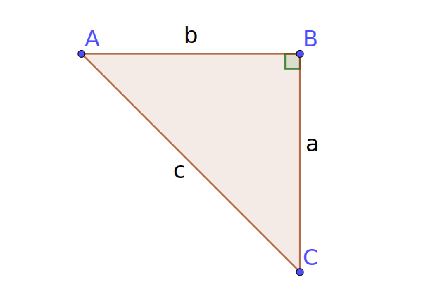
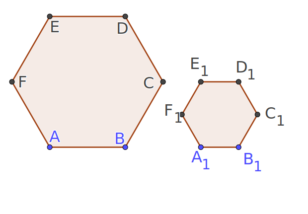
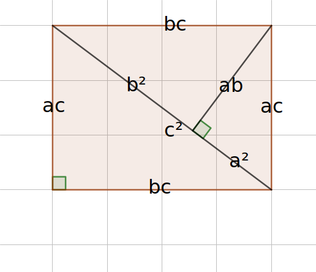

---
category:
  - Study
  - Math
---

# 开头

我们知道一些三角形的数学公式,比如勾股定理

$$
a^2+b^2=c^2
$$

那么你有没有想过人们是怎么知道这个公式的呢?

## 勾股定理的图形证明
首先来理解一个概念,那就是相似

假设现在有2个形状相同,大小不同的多边形

::: info 哈哈
实际上这是2个正六边形
:::

`对应角的关系`

$$
\angle A= \angle A_1 \\
\angle B= \angle B_1 \\
\angle C= \angle C_1 \\
\angle D= \angle D_1 \\
\angle E= \angle E_1 \\
\angle F= \angle F_1 \\
$$
`对应边的关系`
$$
AB=A_1B_1\\
BC=B_1C_1\\
CD=C_1D_1\\
DE=D_1E_1\\
DF=E_1F_1\\
FA=F_1A_1\\
$$
这样,我们就说$六边形ABCDEF$ 相似于$六边形A_1B_1C_1D_1E_1F_1$

$$
对应角的关系\leftrightarrow对应边的关系\\
$$

那么我们假设有一个直角三角形ABC,其三边分别是$a, b, c$,那么根据相似原理,作出三个直角三角形,三个直角三角形的边分别为$aa(a^2), ab, ac$和$ab, bb(b^2), bc$以及$ac, bc, cc(c^2).那么这3个直角三角形相似,将它们拼凑成一个矩形,如图

::: info 注
推导过程不写了,过于简单
:::

注意中线,我门可以得到
$$a^2 + b^2 = c^2$$

那么如果我们构建的三角形不是直角三角形,而是其他的三角形呢?