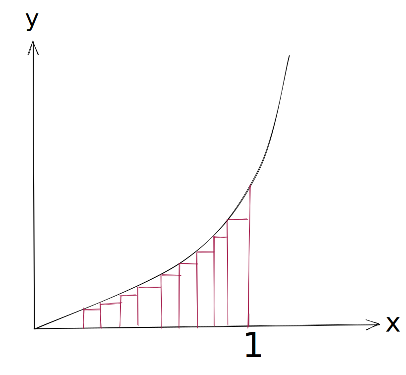

# 定积分

首先考虑求面积：$f(x)=x^2$在$0\to1$的面积，我们把该面积拆分为 n 个底边相等的矩形

每个矩形的底边为
$$\frac{1-0}{n}=\frac{1}{n}$$

区间$[0,1]$被矩形底边分为 n 个区间，设第 i 个区间的左端点为$(1-0)\frac{i}{n}$，则该点对应的$f(x)$为$f(\frac{i}{n})$，则以该点为矩形底边的一个端点，另一个端点为$f(\frac{1+i}{n})$，则求得该矩形面积

$$
S=\bigg(f(\frac{i}{n})+f(\frac{1+i}{n})\bigg)\frac{1-0}{n}
$$

那么面积的和为

$$
S_{all}=\sum_{i=1}^{n-1}\bigg(f(\frac{i}{n})+f(\frac{1+i}{n})\bigg)\frac{1-0}{n}
$$

算了不想说了，直接给定积分

$$
\int_a^bf(x)dx=\lim_{n\to\infty}\sum_{i=1}^{n-1}f(a+\frac{b-a}{n}i)\frac{b-a}{n}
$$

当求数列

$$
\sum_{i=1}^ni=\int\big(\sum_{i=1}^n1+c\big)=\int (n+c) =\frac{1}{2}n^2+cn
$$
