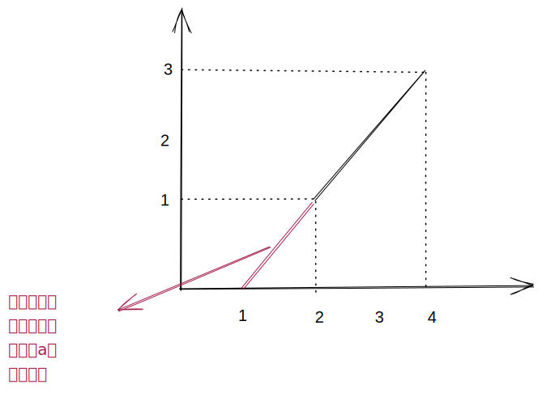
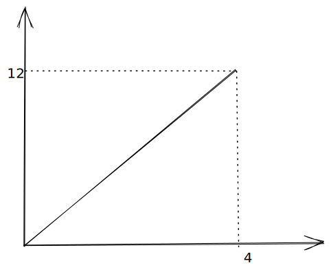

当牵引力大于等于最大静摩擦力时，合力

$$
F_{all} = F_q-F_f=F_q-umg=ma \\
a = \frac{F_q}{m} - ug
$$

先求该速度的斜率

$$
k_a = \frac{3-1}{4-2}=1
$$

设该直线方程

$$
a = k_at+b
$$

代入(2,1)得到

$$
a = t - 1
$$

当加速度$a$等于$0$时

$$
a = t - 1 = 0 \\
t = 1
$$

在图 a 中

斜率$k=\frac{12}{4}=3$

当$t=1$时，牵引力$F_q=3$，由牛顿第三定律得牵引力=摩擦力，故摩擦力$F_f=3N$

当$t=2$时，$F_q=6, a=1$

当$t=4$时，$F_q=12, a=3$

代入$a = \frac{F_q}{m} - ug$

$$
\begin{cases}
    1=\frac{6}{m}-ug\\
    3=\frac{12}{m}-ug
\end{cases}\to m=3kg
$$

任意代入上式

$$
1=\frac{6}{3}-ug\to u=\frac{1}{10}
$$
